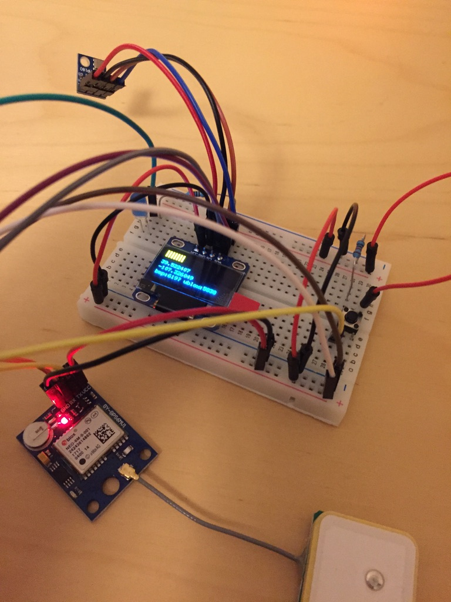

# Dependencies

1. TinyGPS
2. Adafruit BMP085
3. U8glib

| Components      |                                  |
|-----------------|----------------------------------|
| 128x64 I2C OLED           | http://amzn.to/2DCgqqy |
| 3.3 Volt Arduino Pro Mini | http://amzn.to/2Ekl7qn |
| BMP180 Barometer          | http://amzn.to/2BZ5nHG |
| DIYMall U-blox Neo 6M GPS | http://amzn.to/2CuWlTX |
| U-blox Neo 6M GPS         | http://amzn.to/2C2ikjG |
| SDCard SPI                | http://amzn.to/2C6avK7 |
| Charge Module             | http://amzn.to/2CpVUMZ |
| **Extras** ||
| LED, Resistors, Buttons   | http://amzn.to/2Cgyuu4 |
| USB 3.3/5v FTDI           | http://amzn.to/2CkjBpZ |

# Power

All components will be direct to battery using built in regulators. Bat+ -> RAW to power the Pro Mini.  Waypoint button
and LED powered from VCC.

## Arudino

From what I've read the Pro Mini RAW input regulator will work down to 3.5V.  Seems all the components have 
their own 3.3V regulator or can handle voltage ranges from the 1s lipo (@3.3V - 4.2V).

Reading voltage with divider described here [here](https://forum.arduino.cc/index.php?topic=420527.0)

    // Added the 1.008 as adjustment from measured voltage
    (analogRead(pin)*ARef/1024.0) * (R1+R2)/R2 * 1.008

## DIYmall GPS

This module seems very sensitive to voltages close to or under 3.3v.  When running all the components via Arduino VCC 
was hit or miss to get any satellites.

The Neo 6M module [specs](https://www.u-blox.com/sites/default/files/products/documents/NEO-6_DataSheet_%28GPS.G6-HW-09005%29.pdf)
The DIYmall version listed has input of 3V to 5V volts.

## DIYmall OLED

3.3V to 5V volts so running direct from 1s lipo which will be **3.3** to **4.2**

## BMP180

One listed has 3.3v regulator

# Prototyping

# Enclosure Notes

Ublox Antenna 25 x 25mm with 3mm fillet

Screen 27 x 15mm

Screen Mounting Holes are about 20mm x 22mm center

      O------- 20mm -------O
      |  2mm               |
      |---- Screen Top ----|
      |                    |
    22mm                   |
      |                    |
      |---- Screen Bot ----|
      |  6mm               |
      |                    |
      O ------- 20mm ------O